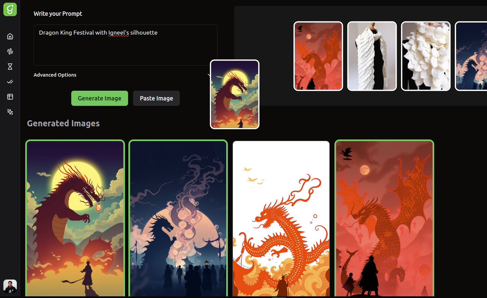
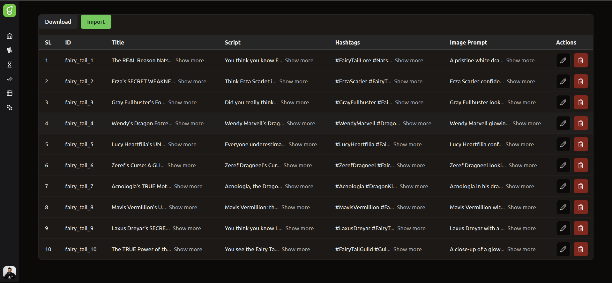
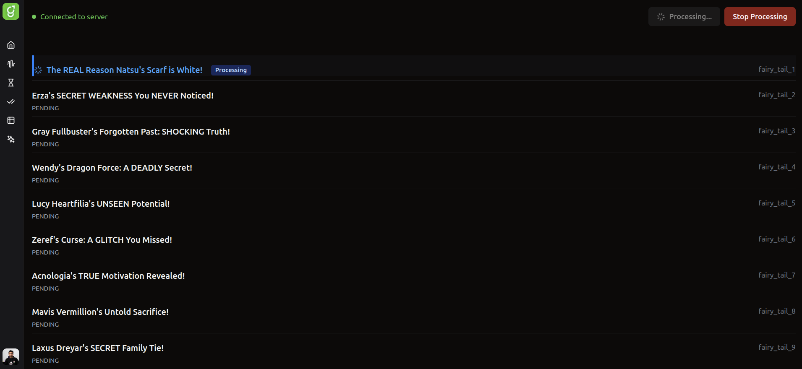

# ReelGenix - YouTube Shorts Generator

This open-source application serves as a robust solution for generating YouTube Shorts, facilitating the creation of engaging video content. It supports the generation of images, audio, and video, and includes functionality for bulk video uploading via Excel spreadsheets.

-----
### Application Interface

<p align="center">
  
  <br>
  <em>Home screen: Start generating YouTube Shorts with a simple interface.</em>
</p>

<p align="center">
  
  <br>
  <em>Bulk upload table: Manage and track bulk Video, Image and Audio generation from Excel Sheet</em>
</p>

<p align="center">
  
  <br>
  <em>Generation process: Rendering the Video in Single Process</em>
</p>


## Features

  * **Single End-to-End Video Generation:** Create complete video content from start to finish.
  * **Bulk Video Generation:** Efficiently produce multiple videos simultaneously.

-----

## Planned Enhancements

  * **Multi-threading Implementation:** Improve performance and generation speed.
  * **Scheduled YouTube Uploads:** Automate the process of publishing videos to YouTube.

-----

## Getting Started with Docker Compose

To run this application using Docker Compose, follow these steps:

1.  **Build and Start Services:**

    ```bash
    docker compose up --build
    ```

2.  **Access the Application:**
    The React application will be accessible at:
    [http://localhost:5173](https://www.google.com/search?q=http://localhost:5173)

3.  **Stop Services:**
    To stop all running services:

    ```bash
    docker compose down
    ```

-----

**Note:** The `public` folder is mounted, ensuring that all generated files are readily accessible on your host machine.